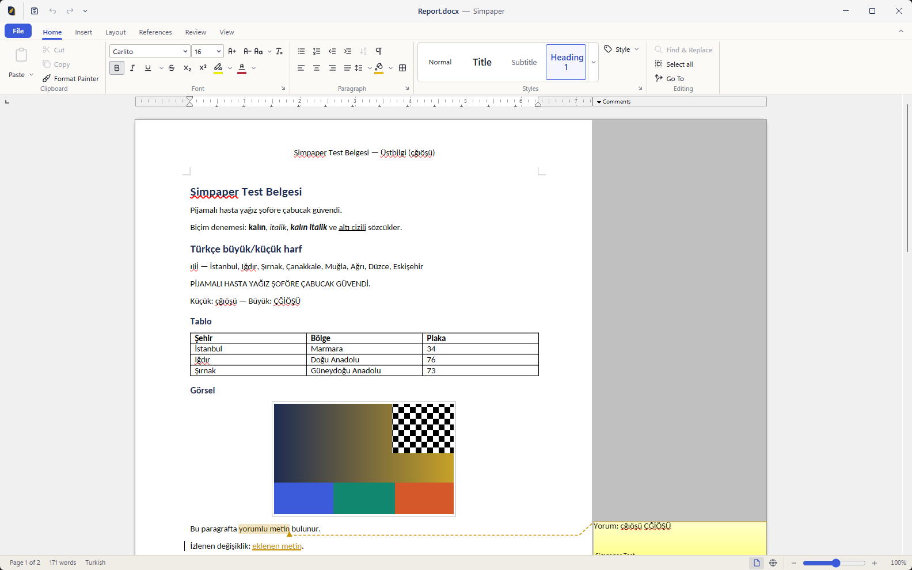
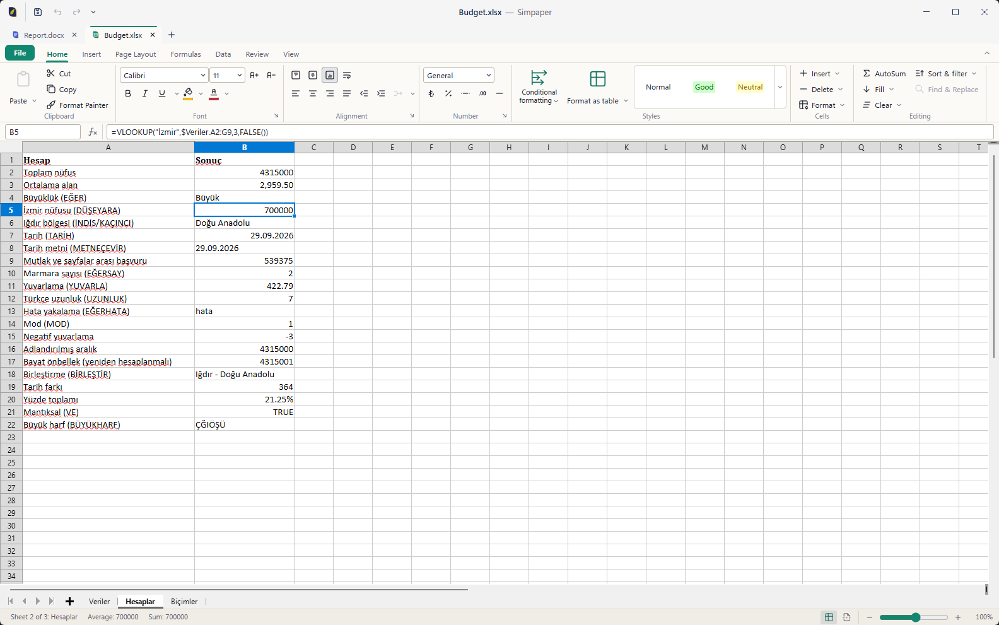
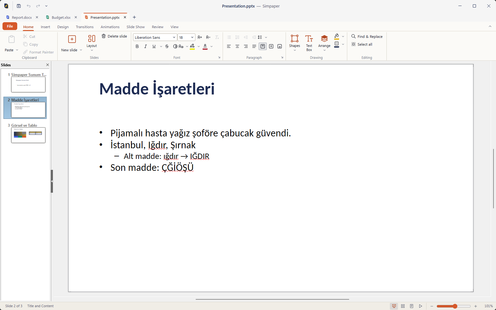
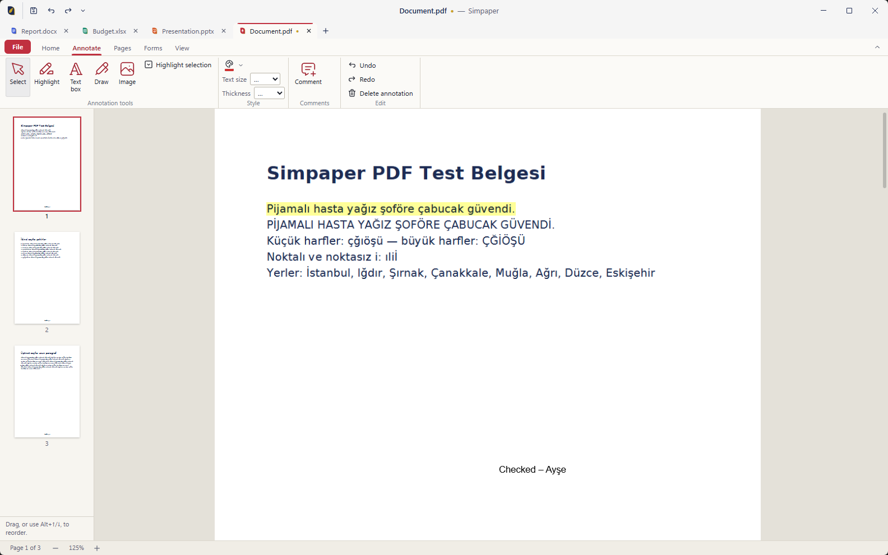
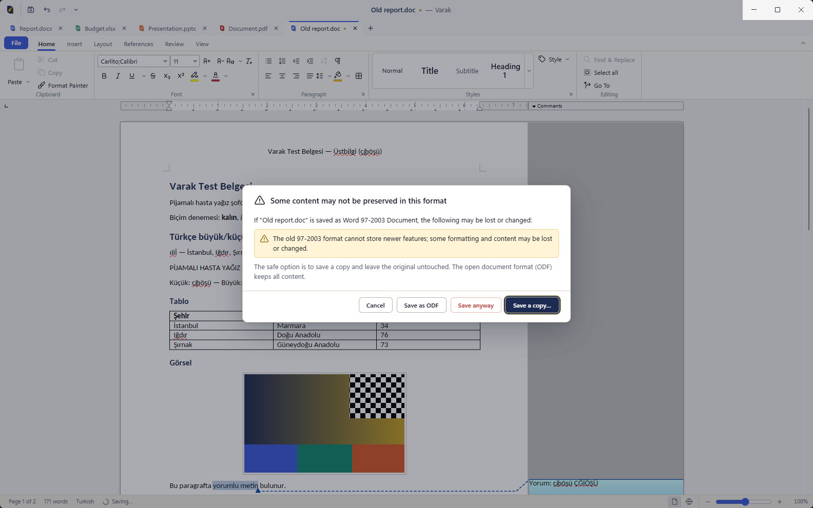

<p align="center">
  
</p>

<h1 align="center">Varak</h1>

<p align="center">
  A free, open-source office suite for Windows with a familiar ribbon — documents, spreadsheets, presentations
  and PDF — built on the proven LibreOffice engine. Local-first, no accounts, no telemetry.
</p>

<p align="center"><a href="README.tr.md">Türkçe</a> · <a href="docs/ARCHITECTURE.md">Architecture</a> ·
<a href="docs/COMPATIBILITY.md">Compatibility</a> · <a href="docs/KNOWN_LIMITATIONS.md">Known limitations</a> ·
<a href="CONTRIBUTING.md">Contributing</a></p>

> [!WARNING]
> **Status: early development (v0.1 milestone in progress).** Varak is not ready for everyday use and has no
> release yet. Do not use it for important documents. Progress is tracked in [docs/STATUS.md](docs/STATUS.md) and
> [docs/ROADMAP.md](docs/ROADMAP.md).

## Why Varak

These are the goals of the first version; [What works today](#what-works-today) says how far each one is.

- **Familiar to Office users.** An Office-style ribbon with Home, Insert, Layout, Review and View tabs, a Quick Access
  Toolbar, a File backstage, document tabs and keyboard access — designed so people who know Word, Excel and
  PowerPoint find their way immediately.
- **A proven engine, unmodified.** Documents, spreadsheets and presentations are opened, edited, recalculated and
  saved by **LibreOffice 26.8**, bundled and redistributed exactly as The Document Foundation publishes it. Varak
  adds the interface around it instead of reinventing file-format support.
- **Your files stay on your computer.** Varak works offline, needs no account, no subscription and no cloud, sends
  **no telemetry**, and never writes document content to its logs.
- **Careful with your data.** Saving goes through a safe pipeline (temporary file → verification → atomic replace),
  Varak warns *before* it saves into a format that would lose content and offers to save a copy, and autosave
  snapshots allow recovery after a crash. Macros are never executed.
- **Four modules in one app:** Documents (DOCX), Spreadsheets (XLSX), Presentations (PPTX) and PDF, plus DOC, XLS,
  PPT, ODF, RTF, CSV and more.
- **Turkish and English** user interface, with Turkish-aware text handling (İ/ı, sorting, number formats, CSV with
  `;`).
- **Free and open source** under the Mozilla Public License 2.0. **Windows-first**: Windows 10 and 11 (x64).

## What works today

Varak is being built toward its first installable version. Honest summary as of 2026-09-29. "Unit-tested"
means automated tests without the running application; "tested with the real engine" means automated tests that
drive LibreOffice without showing windows. Nothing below has been tried by a person in the running app yet.
Test counts: 643 unit tests, 107 engine integration tests, 65 bridge tests ([docs/STATUS.md](docs/STATUS.md)).

| Area | State |
|---|---|
| Research and architecture | **Done:** engine, shell, PDF stack, file formats, UX mapping and test corpus researched with sources; decisions recorded as [ADRs](docs/adr/README.md) |
| Engine | **Done:** LibreOffice 26.8.0.3 pinned and verified (SHA-256 + OpenPGP signature); scripts to fetch, verify, extract and prepare it; a headless smoke test converts Turkish text to PDF and DOCX with the bundled fonts |
| Hosting LibreOffice's editing view inside Varak's window | **Implemented and used on screen (100 % scaling):** LibreOffice's view as a child window in a layered container of the Varak window, a still image of the document while menus overlap it, process guard and hang detection. Automated GUI runs with real mouse and keyboard on the packaged app passed: placement and window moves, Turkish typing, ribbon commands, drop-downs over the document, saving, Calc formulas, Impress with its slide pane, PDFs, themes ([GUI spike](docs/testing/GUI_SPIKE.md)). LibreOffice's own dialogs open over the document with the keyboard focus. After working in the document, the ribbon's text boxes and Varak's own dialogs get the keyboard; for an engine that stops responding, Varak offers a restart in a separate window (while it hangs, Windows passes no input to the Varak window either). The owned-overlay alternative hung LibreOffice on this PC and is for development only. Scaled displays are still to be checked. |
| Document lifecycle (open → edit → save) | **Implemented and tested with the real engine** (`tests/engine/documents-*`): open, edit, save through the full safe-save pipeline, reopen, save-risk prompt with "save a copy", PDF export, autosave snapshot and restore, restore after killing the engine. The real application starts, creates, queries and closes Writer, Calc and Impress documents in an automated smoke test with a hidden window (also the packaged build). It starts reliably on Turkish Windows after an upstream start-up hang was found and worked around ([details](docs/dev/engine.md)). |
| Safe save, loss-risk warnings, autosave and crash recovery | **Implemented and unit-tested:** safe save with fault injection (`tests/unit/main/safeWrite.test.ts`), detection of content that a format would lose (`compat.test.ts`), save-risk prompts with "save a copy" (`documentService.test.ts`), autosave snapshots and restore (`recovery.test.ts`) |
| Ribbon, backstage, tabs, status bar, KeyTips, Turkish/English UI, themes | **Implemented, unit-tested and used on screen:** Office-style ribbons for all four modules with contextual tabs, adaptive layout and KeyTips, Quick Access Toolbar, File backstage, document tabs, status bars with zoom, prompts, Turkish and English (every key in both), light/dark/high-contrast themes (`tests/unit/renderer`). KeyTips were checked on screen as well. |
| Documents, Spreadsheets and Presentations modules | **Implemented; the core flows were used on screen:** typing and saving in Writer, a formula in Turkish syntax in Calc, a new slide with the slide pane in Impress. 202 Writer, 225 Calc and 164 Impress commands, each checked against LibreOffice 26.8's command registry and confirmed to dispatch in a headless engine; Calc formula bar and selection statistics; slide commands and slide show |
| File-format round trips in the engine | **Automated tests pass** (`tests/engine`): generated DOCX, XLSX and PPTX files with Turkish content and license-clean sample files are opened and saved by headless LibreOffice and checked with independent readers and a page-by-page visual comparison, plus conversions to ODF, CSV, TXT, RTF, legacy and template formats. These tests drive the engine directly, not yet through Varak's app; what they found is listed in the [compatibility matrix](docs/COMPATIBILITY.md#test-status). |
| PDF module | **Implemented and unit-tested; the viewer was used on screen** (a text PDF and a form PDF with Turkish text): viewing with thumbnails, Turkish-aware search (İ/ı), highlight, free text, ink, images and comments, form filling, rotating, deleting, moving, inserting and duplicating pages, merging and extracting, adding text and images, printing, and saving with verification (`tests/unit/pdf`). Highlighting, free-text notes and saving were also checked on screen (the saved file read back independently); the other tools only by unit tests. |
| Installer, CI, repository documents | **Installer and ZIP build** (`npm run dist:win`: 331 MB installer, 436 MB ZIP); the packaged app passed the hidden-window smoke test for all three office modules. The installer was installed and used on the development PC (per user, without administrator rights); it has not yet been run on a clean machine and there is no public release. CI workflows, community files and documentation are in place; CI has not run on GitHub yet. |

Nothing has been verified in Microsoft Office; see [docs/TESTING.md](docs/TESTING.md).

## Planned

- **v0.1 — first installable version:** open, edit and save DOCX, XLSX and PPTX with the ribbon; PDF viewing,
  annotation, form filling and page operations; export to PDF; safe save, loss warnings and crash recovery; Turkish
  and English UI, light and dark theme, keyboard access to the ribbon; per-user installer and ZIP.
- **v0.2 — depth and fidelity:** find and replace, print preview, styles gallery, comments and track changes UI,
  Calc sort/filter/freeze/conditional formatting/charts, Impress layouts and transitions, more PDF annotation types,
  high-DPI verification, broader visual regression tests.
- **v0.3 — format coverage and robustness:** verified matrix for all legacy and ODF formats, CSV import dialog,
  password handling, large-file performance, file associations, auto-update and signed releases.
- **Later:** pivot tables and advanced charts, correcting existing PDF text, redaction, OCR for scanned PDFs,
  accessibility audit, and exploration of Linux and macOS.

Details and acceptance criteria: [docs/ROADMAP.md](docs/ROADMAP.md).

## Screenshots

Real screenshots of the packaged app (Windows 11, 100 % scaling), captured with `scripts/gui/screenshots.mjs` as
described in [docs/DEMO.md](docs/DEMO.md); no mock-ups, no retouching. All images and their details are listed in
[docs/screenshots/](docs/screenshots/README.md).



| Spreadsheets | Presentations |
|---|---|
|  |  |
| **PDF** | **Loss warning** |
|  |  |

The same screens with the Turkish interface are in the [Turkish README](README.tr.md#ekran-görüntüleri).

## Install

There is no release yet. When v0.1 is released, the [GitHub releases](https://github.com/varak-office/varak/releases)
page will offer:

- **`Varak-Setup-<version>-x64.exe`** — a per-user installer that does not need administrator rights;
- **`Varak-<version>-x64.zip`** — the same application for portable use (unzip and run `Varak.exe`).

Requirements: Windows 10 or 11, 64-bit, about 1.5 GB of free disk space. The first releases will not be code-signed,
so Windows SmartScreen will show a warning; signing through the SignPath Foundation is planned
([docs/PACKAGING.md](docs/PACKAGING.md#signing-plan)).

## Build from source

Prerequisites: Windows 10/11 x64, [Node.js](https://nodejs.org/) 22.13 or newer, [Git for Windows](https://gitforwindows.org/)
(its `gpg` verifies the engine download), and about 6 GB of free disk space (about 3.5 GB without building the
installer).

```powershell
git clone https://github.com/varak-office/varak.git
cd varak
npm ci                                  # install dependencies
npm run engine:fetch                    # download, verify and extract LibreOffice 26.8.0.3 into vendor/
npm run engine:prepare -- --verify      # build the trimmed engine folder and smoke-test it (headless)
npm run dist:win -- --publish never     # build the installer and the ZIP into release/
```

See [docs/PACKAGING.md](docs/PACKAGING.md) for details, sizes and the release process.

## Development quick start

```powershell
npm ci                 # dependencies
npm run engine:fetch   # engine for development and engine tests (once; about 0.4 GB download)
npm test               # unit tests
npm run test:engine    # headless LibreOffice round-trip tests (no windows)
npm run dev            # starts the app with hot reload (opens windows)
```

Also useful: `npm run lint`, `npm run typecheck`, `npm run build`. Contributors should read
[CONTRIBUTING.md](CONTRIBUTING.md) first; it also explains a VS Code pitfall (`ELECTRON_RUN_AS_NODE`) and which
tests may open windows.

## Documentation

| Document | Content |
|---|---|
| [Architecture](docs/ARCHITECTURE.md) | How the pieces fit together and why |
| [Decision records](docs/adr/README.md) | Engine, shell, document surface, PDF stack, data integrity, license, name, packaging |
| [Compatibility matrix](docs/COMPATIBILITY.md) | What opens, edits, saves and may be lost, per format |
| [Known limitations](docs/KNOWN_LIMITATIONS.md) | What does not work or has not been verified |
| [Testing](docs/TESTING.md) | Test layers, commands and what they can prove |
| [Manual test guide](docs/TEST_REHBERI.md) (Turkish) | Step-by-step checks with expected results for testers |
| [Packaging](docs/PACKAGING.md) | Reproducible builds, the engine lock, signing plan |
| [Roadmap](docs/ROADMAP.md) and [status](docs/STATUS.md) | Milestones and current progress |
| [Changelog](CHANGELOG.md) | Notable changes per version |
| [Research](docs/research/README.md) | The sourced research behind the decisions (2026-09-28) |

## Contributing

Contributions are welcome — code, translations, test files with clean licenses, bug reports and documentation. Please
read [CONTRIBUTING.md](CONTRIBUTING.md) and follow the [Code of Conduct](CODE_OF_CONDUCT.md). Never attach confidential
documents to issues.

## Security and privacy

Please report vulnerabilities privately as described in [SECURITY.md](SECURITY.md), not in public issues. Varak has no
telemetry and no online features, downloads nothing at run time, and never executes document macros or PDF
JavaScript.

## License

Varak is licensed under the [Mozilla Public License 2.0](LICENSE). It includes third-party software under other
licenses — above all the unmodified LibreOffice engine, whose license files are shipped with it — listed in
[THIRD_PARTY_NOTICES.md](THIRD_PARTY_NOTICES.md).

## Trademarks

LibreOffice is a registered trademark of The Document Foundation. Microsoft, Word, Excel and PowerPoint are trademarks
of the Microsoft group of companies. Varak is an independent project and is not affiliated with, endorsed by or
sponsored by The Document Foundation or Microsoft. "Varak" is a working name; see
[ADR 0007](docs/adr/0007-product-name.md).
