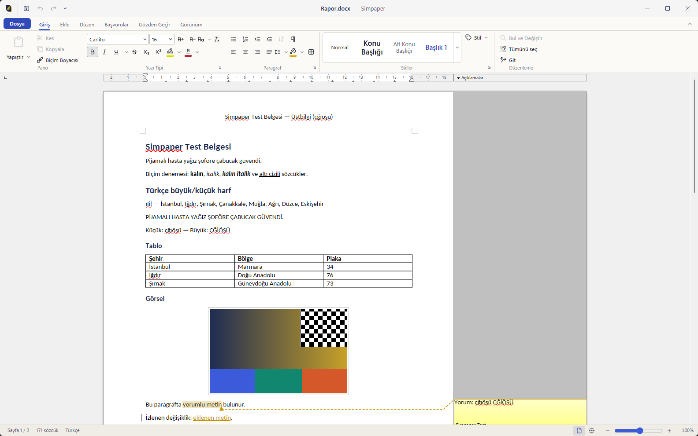
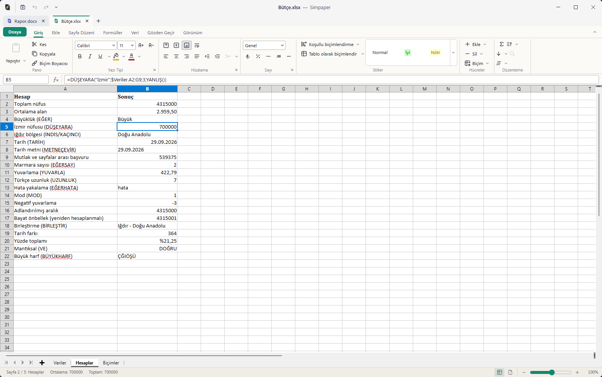
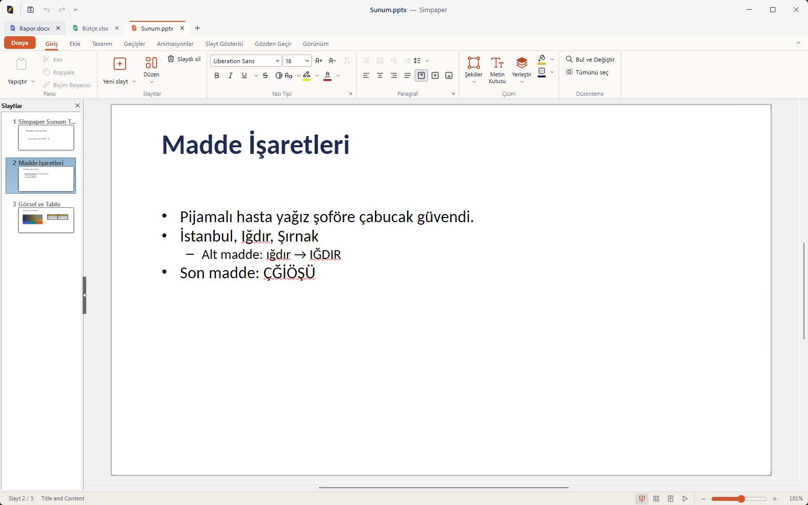
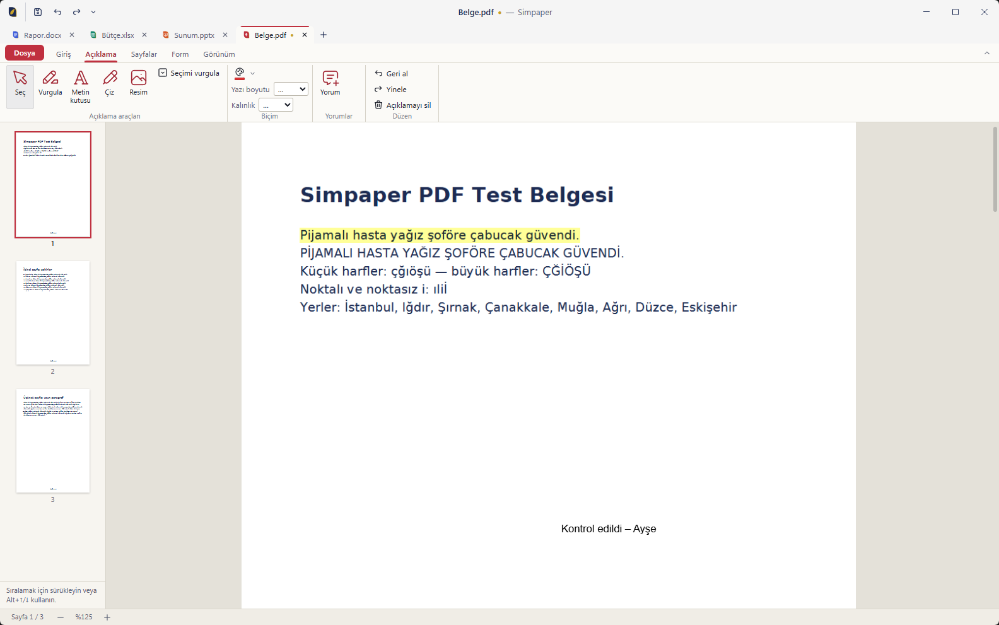
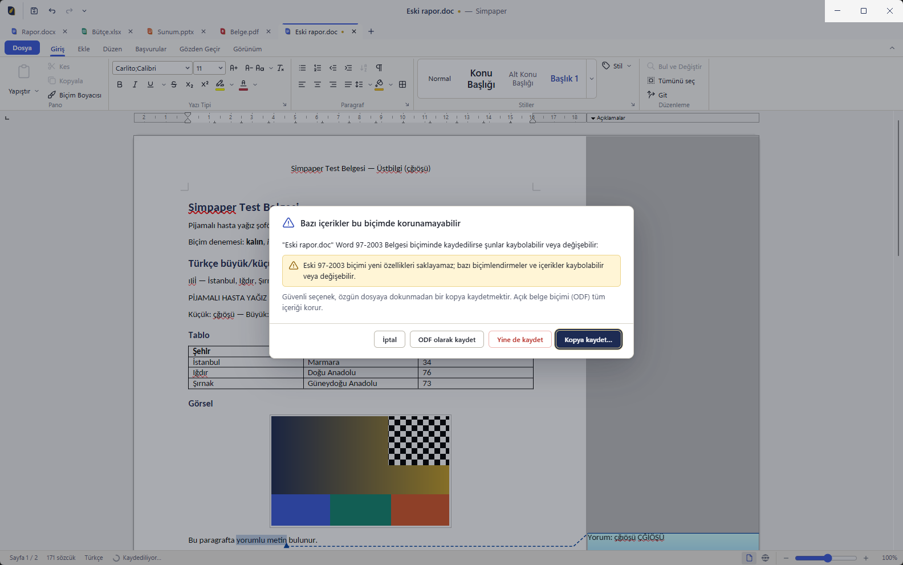

<p align="center">
  
</p>

<h1 align="center">Simpaper</h1>

<p align="center">
  Windows için tanıdık bir şeride sahip, özgür ve açık kaynaklı ofis paketi: belgeler, hesap tabloları, sunular ve
  PDF. Kendini kanıtlamış LibreOffice motoru üzerine kurulu. Dosyalarınız bilgisayarınızda kalır; hesap gerekmez,
  telemetri yoktur.
</p>

<p align="center"><a href="README.md">English</a> · <a href="docs/ARCHITECTURE.md">Mimari</a> ·
<a href="docs/COMPATIBILITY.md">Uyumluluk</a> · <a href="docs/KNOWN_LIMITATIONS.md">Bilinen sınırlamalar</a> ·
<a href="CONTRIBUTING.md">Katkıda bulunma</a></p>

> [!WARNING]
> **Durum: erken geliştirme aşaması (v0.1 kilometre taşı üzerinde çalışılıyor).** Simpaper henüz günlük kullanıma hazır
> değildir ve yayımlanmış bir sürümü yoktur. Önemli belgeleriniz için kullanmayın. İlerleme
> [docs/STATUS.md](docs/STATUS.md) ve [docs/ROADMAP.md](docs/ROADMAP.md) dosyalarında izlenir.

Ayrıntılı proje belgeleri (mimari, uyumluluk tablosu, testler, paketleme) şimdilik yalnızca İngilizcedir.

## Neden Simpaper?

Aşağıdakiler ilk sürümün hedefleridir; her birinin ne kadarının hazır olduğunu
[Bugün neler çalışıyor?](#bugün-neler-çalışıyor) bölümü anlatır.

- **Office kullananlara tanıdık.** Giriş, Ekle, Düzen, Gözden Geçir ve Görünüm sekmeleriyle Office tarzı bir şerit,
  Hızlı Erişim Araç Çubuğu, Dosya menüsü, belge sekmeleri ve klavyeyle erişim: Word, Excel ve PowerPoint'i bilenler
  yollarını hemen bulabilsin diye tasarlandı.
- **Kendini kanıtlamış, değiştirilmemiş bir motor.** Belgeler, hesap tabloları ve sunular **LibreOffice 26.8** ile
  açılır, düzenlenir, yeniden hesaplanır ve kaydedilir. Motor, The Document Foundation'ın yayımladığı haliyle, hiç
  değiştirilmeden pakete eklenir. Simpaper dosya biçimi desteğini yeniden icat etmez; motorun çevresine arayüzü kurar.
- **Dosyalarınız bilgisayarınızda kalır.** Simpaper çevrimdışı çalışır; hesap, abonelik ya da bulut gerektirmez,
  **telemetri göndermez** ve günlük (log) dosyalarına asla belge içeriği yazmaz.
- **Verilerinize özen gösterir.** Kaydetme güvenli bir süreçten geçer (geçici dosya → doğrulama → tek adımda
  değiştirme). İçerik kaybettirecek bir biçimde kaydetmeden *önce* Simpaper sizi uyarır ve bir kopya kaydetmeyi önerir;
  otomatik kaydedilen anlık görüntüler bir çökmeden sonra kurtarmayı mümkün kılar. Makrolar asla çalıştırılmaz.
- **Tek uygulamada dört modül:** Belge (DOCX), Hesap Tablosu (XLSX), Sunu (PPTX) ve PDF; ayrıca DOC, XLS, PPT, ODF,
  RTF, CSV ve daha fazlası.
- **Türkçe ve İngilizce** arayüz; Türkçeye uygun metin işleme (İ/ı, sıralama, sayı biçimleri, `;` ayırıcılı CSV).
- Mozilla Public License 2.0 ile **özgür ve açık kaynak**. **Önce Windows:** Windows 10 ve 11 (x64).

## Bugün neler çalışıyor?

Simpaper ilk kurulabilir sürümüne doğru geliştiriliyor. 2026-09-30 itibarıyla dürüst bir özet: "Birim testlerinden
geçti" ifadesi, uygulama çalıştırılmadan yürütülen otomatik testleri; "gerçek motorla test edildi" ifadesi, pencere
göstermeden LibreOffice'i süren otomatik testleri; "ekranda kullanıldı" ifadesi ise paketlenmiş uygulamada gerçek fare
ve klavye girdisiyle yapılan otomatik GUI denemelerini kasteder. Bu denemeler dışında bir betik, Simpaper yükleyicisini
geliştirme bilgisayarına kurup dosya türlerini, simgeleri, çift tıklamayı, güncellemeyi ve kaldırmayı denetledi
([sonuçlar](docs/PACKAGING.md#real-installation), İngilizce); sahibi de ad değişikliğinden önceki bir derlemeyi (o
zamanki adıyla Varak) kurup denedi. Kayıtlı bir elle test turu ([docs/TEST_REHBERI.md](docs/TEST_REHBERI.md)) henüz
yok. Test sayıları: 794 birim testi (68 dosya),
115 motor entegrasyon testi (14 dosya; ayrıca 5 test atlandı: isteğe bağlı üç uzun döngü ve tasarım gereği iki test),
109 köprü testi ([docs/STATUS.md](docs/STATUS.md)).

| Alan | Durum |
|---|---|
| Araştırma ve mimari | **Tamamlandı:** motor, uygulama kabuğu, PDF altyapısı, dosya biçimleri, Office arayüz eşlemesi ve test belgeleri kaynaklarıyla araştırıldı; kararlar [ADR](docs/adr/README.md) olarak kaydedildi |
| Motor | **Tamamlandı:** LibreOffice 26.8.0.3 sabitlendi ve doğrulandı (SHA-256 + OpenPGP imzası); motoru indiren, doğrulayan, açan ve paketlemeye hazırlayan betikler var; pencere açmadan (headless) çalışan bir duman testi, Türkçe metni motorla gelen yazı tipleriyle PDF'ye ve DOCX'e dönüştürüyor |
| LibreOffice düzenleme görünümünün Simpaper penceresine yerleştirilmesi | **Uygulandı ve ekranda kullanıldı (%100 ölçekte):** LibreOffice görünümü, Simpaper penceresindeki katmanlı bir kapsayıcının alt penceresi olarak; menüler belgenin üzerine açıldığında belgenin durağan bir görüntüsü, süreç koruması ve donma algılama. Paketlenmiş uygulamada gerçek fare ve klavyeyle yapılan otomatik GUI denemeleri geçti: yerleşim ve pencere taşıma, Türkçe yazma, şerit komutları, belgenin üzerine açılan menüler, kaydetme, Calc formülleri, slayt paneliyle Impress, PDF'ler, temalar ([GUI denemesi](docs/testing/GUI_SPIKE.md)). LibreOffice'in kendi iletişim kutuları belgenin üzerinde, klavye odağıyla açılıyor. Belgede çalıştıktan sonra şeritteki metin kutuları ve Simpaper'ın pencereleri klavyeyi alıyor; yanıt vermeyen bir motor için Simpaper ayrı bir pencerede yeniden başlatmayı öneriyor (motor takılıyken Windows, Simpaper penceresine de girdi iletmez). Sahipli bindirme penceresi seçeneği bu bilgisayarda LibreOffice'i dondurdu ve yalnızca geliştirme içindir. Ölçekli ekranlar henüz denetlenmedi. |
| Belge yaşam döngüsü (aç → düzenle → kaydet) | **Uygulandı ve gerçek motorla test edildi** (`tests/engine/documents-*`): açma, düzenleme, tam güvenli kaydetme hattından geçerek kaydetme, yeniden açma, "kopya olarak kaydet" seçenekli kayıp riski istemi, PDF'e dışa aktarma, otomatik kaydetme anlık görüntüsü ve geri yükleme, motor süreci sonlandırıldıktan sonra geri yükleme. Gerçek uygulama, gizli bir pencereyle çalışan otomatik açılış testinde Writer, Calc ve Impress belgelerini oluşturup sorgulayıp kapatıyor (paketlenmiş sürüm dahil). LibreOffice'in Türkçe Windows'ta başlangıçta takılmasına yol açan bir hata bulundu ve çevresinden dolaşıldı ([ayrıntılar](docs/dev/engine.md)). |
| Güvenli kaydetme, kayıp riski uyarıları, otomatik kaydetme ve çökme kurtarma | **Uygulandı ve birim testlerinden geçti:** hata enjeksiyonuyla güvenli kaydetme (`tests/unit/main/safeWrite.test.ts`), bir biçimin kaybedeceği içeriğin algılanması (`compat.test.ts`), "kopya olarak kaydet" seçenekli kaydetme riski istemleri (`documentService.test.ts`), otomatik kaydetme anlık görüntüleri ve geri yükleme (`recovery.test.ts`) |
| Şerit, Dosya menüsü, sekmeler, durum çubuğu, tuş ipuçları, Türkçe/İngilizce arayüz, temalar | **Uygulandı, birim testlerinden geçti ve ekranda kullanıldı:** dört modül için bağlamsal sekmeleri, uyarlanır yerleşimi ve tuş ipuçları olan Office tarzı şeritler, Hızlı Erişim Araç Çubuğu, Dosya menüsü, belge sekmeleri, yakınlaştırmalı durum çubukları, istemler, Türkçe ve İngilizce (her anahtar iki dilde), açık/koyu/yüksek karşıtlık temaları (`tests/unit/renderer`). Tuş ipuçları da ekranda denetlendi. |
| Belge, Hesap Tablosu ve Sunu modülleri | **Uygulandı; temel akışlar ekranda kullanıldı:** Writer'da yazma ve kaydetme, Calc'te Türkçe söz dizimiyle formül, Impress'te slayt paneliyle yeni slayt. 202 Writer, 225 Calc ve 164 Impress komutunun her biri LibreOffice 26.8 komut kaydında denetlendi ve pencere açmadan çalışan motorda gönderilebildiği doğrulandı; Calc formül çubuğu ve seçim istatistikleri; slayt komutları ve slayt gösterisi |
| Motorda dosya biçimi gidiş-dönüşleri | **Otomatik testlerden geçiyor** (`tests/engine`): Türkçe içerikli üretilmiş DOCX, XLSX ve PPTX dosyaları ile lisansı temiz örnek dosyalar, pencere açmadan çalışan LibreOffice ile açılıp kaydediliyor; sonuç, LibreOffice kullanmayan okuyucularla ve sayfa sayfa görsel karşılaştırmayla denetleniyor. ODF, CSV, TXT, RTF, eski Office ve şablon biçimlerine dönüştürmeler de test ediliyor. Bu testler motoru doğrudan kullanır, henüz Simpaper uygulaması üzerinden değil; bulguları [uyumluluk tablosunda](docs/COMPATIBILITY.md#test-status) listelenir. |
| PDF modülü | **Uygulandı, birim testlerinden geçti; görüntüleyici ekranda kullanıldı** (Türkçe metinli bir metin PDF'i ve bir form PDF'i): küçük resimlerle görüntüleme, Türkçeye uygun arama (İ/ı), vurgulama, metin kutusu, çizim, resim ve yorumlar, form doldurma, sayfaları döndürme, silme, taşıma, ekleme ve çoğaltma, PDF birleştirme ve sayfa çıkarma, metin ve resim ekleme, yazdırma ve doğrulamalı kaydetme (`tests/unit/pdf`). Vurgulama, metin kutusu notu ve kaydetme ekranda da denetlendi (kaydedilen dosya bağımsız olarak geri okundu); diğer araçlar yalnızca birim testleriyle. |
| Yükleyici, CI, depo belgeleri | **Yükleyici ve ZIP üretiliyor** (`npm run dist:win`: 330 MiB yükleyici, 436 MiB ZIP); paketlenmiş uygulama üç ofis modülü için gizli pencereli açılış testinden geçti. Simpaper yükleyicisi geliştirme bilgisayarına kuruldu (kullanıcı başına, yönetici izni olmadan) ve bir betikle denetlendi: Windows Simpaper'ın simgelerini gösteriyor, çift tıklama ve çoklu seçim dosyaları açıyor, güncelleme dosya türlerini koruyor, kaldırma geride bir şey bırakmıyor ([ayrıntılar](docs/PACKAGING.md#real-installation), İngilizce). Temiz bir makinede henüz çalıştırılmadı ve genel bir sürüm yok. CI iş akışları, topluluk dosyaları ve belgeler hazır; CI iş akışı `main` dalına yapılan her gönderimde ve her çekme isteğinde GitHub Actions'ta çalışır (sonuçlar deponun Actions sekmesinde). |

Hiçbir şey Microsoft Office'te doğrulanmadı; bkz. [docs/TESTING.md](docs/TESTING.md).

## Planlananlar

- **v0.1 — ilk kurulabilir sürüm:** DOCX, XLSX ve PPTX dosyalarını şeritle açma, düzenleme ve kaydetme; PDF
  görüntüleme, açıklama ekleme, form doldurma ve sayfa işlemleri; PDF olarak dışa aktarma; güvenli kaydetme, kayıp
  uyarıları ve çökme kurtarma; Türkçe ve İngilizce arayüz, açık ve koyu tema, şeride klavyeyle erişim; kullanıcı
  başına yükleyici ve ZIP.
- **v0.2 — derinlik ve doğruluk:** baskı önizleme; v0.1 şeritlerinin LibreOffice komutları ve iletişim kutularıyla
  zaten sunduğu işlevlerin (bul ve değiştir, stiller, yorumlar ve değişiklik izleme; Calc'ta sıralama, filtreleme,
  bölmeleri dondurma, koşullu biçimlendirme ve grafikler; Impress'te düzenler ve geçişler) ekranda doğrulanması ve
  derinleştirilmesi; daha fazla PDF açıklama türü; yüksek DPI doğrulaması; daha kapsamlı görsel regresyon testleri.
- **v0.3 — biçim kapsamı ve sağlamlık:** tüm eski ve ODF biçimleri için doğrulanmış uyumluluk tablosu, belgelere
  parola koyma ve parolayı kaldırma, büyük dosyalarda performans, otomatik güncelleme ve imzalı sürümler.
- **Daha sonra:** özet tablolar ve gelişmiş grafikler, PDF'deki mevcut metni düzeltme, karartma (redaksiyon), taranmış
  PDF'ler için OCR, erişilebilirlik denetimi, Linux ve macOS için ön çalışma.

Ayrıntılar ve kabul ölçütleri: [docs/ROADMAP.md](docs/ROADMAP.md).

## Ekran görüntüleri

Paketlenmiş uygulamanın gerçek ekran görüntüleri (Windows 11, %100 ölçek); [docs/DEMO.md](docs/DEMO.md) dosyasındaki
kurallara göre `scripts/gui/screenshots.mjs` ile alındı, taslak görsel ya da rötuş yok. Tüm görüntüler ve ayrıntıları
[docs/screenshots/](docs/screenshots/README.md) klasöründe.



| Hesap Tablosu | Sunu |
|---|---|
|  |  |
| **PDF** | **Kayıp uyarısı** |
|  |  |

Aynı ekranların İngilizce arayüzlü hâlleri [İngilizce README](README.md#screenshots) dosyasında.

## Kurulum

Henüz yayımlanmış bir sürüm yok. v0.1 yayımlandığında GitHub'daki
[sürümler (Releases)](https://github.com/enestanerr/Simpaper/releases) sayfasında şunlar olacak:

- **`Simpaper-Setup-<sürüm>-x64.exe`**: yönetici hakları gerektirmeyen, yalnızca geçerli kullanıcı için kurulum yapan
  bir yükleyici;
- **`Simpaper-<sürüm>-x64.zip`**: aynı uygulamanın taşınabilir kullanım için ZIP hali (ZIP'i açıp `Simpaper.exe`
  dosyasını çalıştırın).

Gereksinimler: Windows 10 veya 11, 64 bit, yaklaşık 1,5 GB boş disk alanı. İlk sürümler kod imzalı olmayacak; bu yüzden
Windows SmartScreen bir uyarı gösterecek. SignPath Foundation aracılığıyla imzalama planlanıyor
([docs/PACKAGING.md](docs/PACKAGING.md#signing-plan)).

Yükleyici, Simpaper'ın açabildiği dosya türlerini Windows'a kaydeder
([ADR 0010](docs/adr/0010-file-associations.md)):

- O tür için varsayılan başka bir uygulama olmadığı sürece Word, Excel, PowerPoint, OpenDocument, RTF ve PDF
  dosyaları Simpaper'ın simgeleriyle görünür ve çift tıklandığında Simpaper'da açılır.
- Başka bir uygulama varsayılansa (örneğin Microsoft Office, LibreOffice ya da PDF için Microsoft Edge), seçimi
  Windows size bırakır: böyle bir dosyayı bir sonraki açışınızda Simpaper'ı önerir; Simpaper'ı Windows Ayarları ›
  Uygulamalar › Varsayılan uygulamalar sayfasından da seçebilirsiniz. **Dosya › Seçenekler › Dosya türleri**, hangi
  türlerin Simpaper ile açıldığını gösterir ve bu sayfayı açan bir düğme içerir; yükleyici de son adımında bu
  sayfayı açmayı önerir.
- Düz metin, CSV ve TSV dosyalarının varsayılan uygulaması değişmez: Simpaper bunlar için yalnızca seçenek olarak
  sunulur ("Birlikte aç" menüsünde ve Varsayılan uygulamalar sayfasında), varsayılan yapılmaz. ZIP sürümü hiçbir
  dosya türünü kaydetmez.

Kayıt işlemi birim testleriyle, yükleyicinin kurma, güncelleme ve kaldırma adımlarını yalnızca deneme için kullanılan
bir kayıt defteri anahtarında çalıştıran bir betikle ve geliştirme bilgisayarındaki gerçek bir kurulumla denetlendi:
Windows Simpaper'ın simgelerini gösterdi, çift tıklama dosyaları açtı, güncelleme kaydı korudu ve kaldırma her türü
eski hâline getirdi ([ayrıntılar](docs/PACKAGING.md#real-installation), İngilizce). Bir türü başka bir uygulama da
kaydetmişse (orada `.pptx` için bir Microsoft Store uygulaması) Windows, böyle bir dosyayı ilk açışınızda hangi
uygulamayla açılacağını bir kez sorar; Simpaper'ı seçip **Her zaman**'a basın.

## Kaynaktan derleme

Gereksinimler: Windows 10/11 x64, [Node.js](https://nodejs.org/) 22.13 veya üstü,
[Git for Windows](https://gitforwindows.org/) (içindeki `gpg`, motor indirmesini doğrular) ve yaklaşık 6 GB boş disk
alanı (yükleyici derlenmeyecekse yaklaşık 3,5 GB).

```powershell
git clone https://github.com/enestanerr/Simpaper.git
cd Simpaper
npm ci                                  # bağımlılıkları kur
npm run engine:fetch                    # LibreOffice 26.8.0.3'ü indir, doğrula ve vendor/ altına aç
npm run engine:prepare -- --verify      # paketlenecek motor klasörünü oluştur ve pencere açmadan dene
npm run dist:win -- --publish never     # yükleyiciyi ve ZIP'i release/ klasörüne derle
```

Ayrıntılar, boyutlar ve sürüm süreci için: [docs/PACKAGING.md](docs/PACKAGING.md).

## Geliştirmeye hızlı başlangıç

```powershell
npm ci                 # bağımlılıklar
npm run engine:fetch   # geliştirme ve motor testleri için motor (bir kez; yaklaşık 0,4 GB indirme)
npm test               # birim testleri
npm run test:engine    # pencere açmadan LibreOffice ile gidiş-dönüş testleri
npm run dev            # uygulamayı anında yeniden yüklemeyle başlatır (pencere açar)
```

Ayrıca işe yarar: `npm run lint`, `npm run typecheck`, `npm run build`. Katkıda bulunmak isteyenler önce
[CONTRIBUTING.md](CONTRIBUTING.md) dosyasını okumalı; orada VS Code'daki bir tuzak (`ELECTRON_RUN_AS_NODE`) ve hangi
testlerin pencere açabileceği de anlatılıyor.

## Belgeler

| Belge | İçerik |
|---|---|
| [Mimari](docs/ARCHITECTURE.md) | Parçaların nasıl bir araya geldiği ve nedenleri |
| [Karar kayıtları](docs/adr/README.md) | Motor, kabuk, belge yüzeyi, PDF altyapısı, veri bütünlüğü, lisans, ad, paketleme, dosya türleri |
| [Uyumluluk tablosu](docs/COMPATIBILITY.md) | Biçim biçim neyin açıldığı, düzenlendiği, kaydedildiği ve neyin kaybolabileceği |
| [Bilinen sınırlamalar](docs/KNOWN_LIMITATIONS.md) | Neyin çalışmadığı veya henüz doğrulanmadığı |
| [Testler](docs/TESTING.md) | Test katmanları, komutlar ve testlerin neyi kanıtlayabildiği |
| [Elle test rehberi](docs/TEST_REHBERI.md) | Uygulamayı kurup modül modül adım adım deneme listesi ve beklenen sonuçlar |
| [Paketleme](docs/PACKAGING.md) | Tekrarlanabilir derlemeler, motor kilit dosyası, imzalama planı |
| [Yol haritası](docs/ROADMAP.md) ve [durum](docs/STATUS.md) | Kilometre taşları ve güncel ilerleme |
| [Değişiklik günlüğü](CHANGELOG.md) | Sürümlere göre önemli değişiklikler |
| [Araştırma](docs/research/README.md) | Kararların arkasındaki kaynaklı araştırma (2026-09-28) |

## Katkıda bulunma

Katkılarınızı bekliyoruz: kod, çeviri, lisansı temiz test dosyaları, hata bildirimleri ve belgeler. Lütfen
[CONTRIBUTING.md](CONTRIBUTING.md) dosyasını okuyun ve [Davranış Kuralları](CODE_OF_CONDUCT.md)'na uyun. Hata
bildirimlerini ve katkıları Türkçe de yazabilirsiniz. Hata kayıtlarına asla gizli belge eklemeyin.

## Güvenlik ve gizlilik

Güvenlik açıklarını herkese açık kayıtlarda değil, [SECURITY.md](SECURITY.md) dosyasında anlatıldığı gibi gizli olarak
bildirin. Simpaper'da telemetri ve çevrimiçi özellik yoktur; çalışırken hiçbir şey indirmez ve belge makrolarını ya da
PDF JavaScript'ini asla çalıştırmaz.

## Lisans

Simpaper, [Mozilla Public License 2.0](LICENSE) ile lisanslanmıştır. Başka lisanslara tabi üçüncü taraf yazılımlar da
içerir; bunların başında, lisans dosyalarıyla birlikte dağıtılan değiştirilmemiş LibreOffice motoru gelir. Tam liste
[THIRD_PARTY_NOTICES.md](THIRD_PARTY_NOTICES.md) dosyasındadır.

## Ticari markalar

LibreOffice, The Document Foundation'ın tescilli ticari markasıdır. Microsoft, Word, Excel ve PowerPoint, Microsoft
şirketler grubunun ticari markalarıdır. Simpaper bağımsız bir projedir; The Document Foundation veya Microsoft ile
bağlantılı değildir, onlar tarafından onaylanmamış ve desteklenmemektedir. "Simpaper" adının seçimi ve yapılan ad
taraması [ADR 0009](docs/adr/0009-product-name-simpaper.md) dosyasında anlatılır; bu tarama hukuki bir marka
araştırması değildir.
